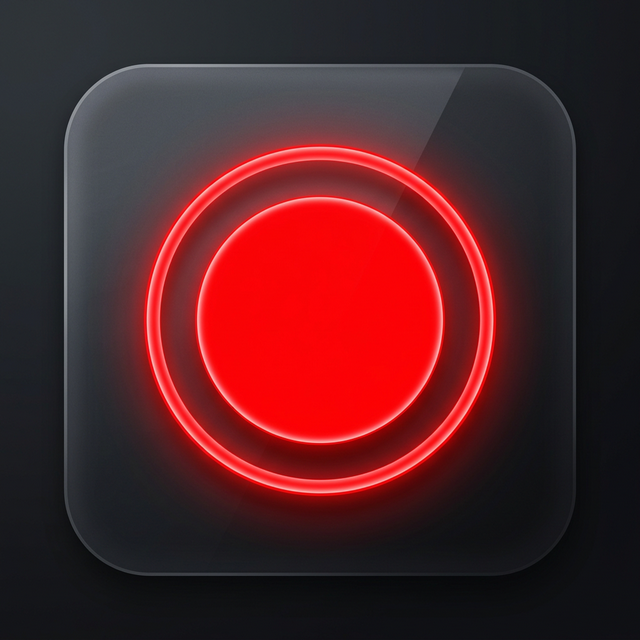

  
  <h1>Eartq - Acil Durum Kayıt Widget'ı</h1>
  
Şık, gizlenebilir ve pratik bir Windows Acil Durum (Kamera & Mikrofon) kayıt aracı.

---

## 📌 Proje Hakkında
**Eartq**, her an elinizin altında bulunması gereken durumlarda (deprem, acil durumlar veya anlık kayıt alma ihtiyacı) hızlıca video ve ses kaydı başlatmanızı sağlayan, her zaman üstte duran modern ve ufak bir masaüstü widget uygulamasıdır. Ayrıca **canlı deprem takip şeridi** ile anlık olarak ülkedeki son sarsıntıları takip etmenize olanak tanır.

Büyük pencerelerle veya karmaşık ayar ekranlarıyla kullanıcıyı yormaz. Ekranda istediğiniz köşede tutabilir veya kullanmadığınız zamanlarda sadece sağ alt köşede (System Tray) gizli modda çalışmasını sağlayabilirsiniz.

## ✨ Özellikler
- **Modern Arayüz:** Neon kırmızı kayıt sinyaline sahip ve koyu tema (Dark Mode) destekli tasarım.
- **Tek Tıkla Kayıt:** Widget üzerindeki ikona bir kez tıkladığınızda kayıt başlar, bir kez daha tıkladığınızda biter ve MP4 olarak kaydedilir.
- **Her Zaman Üstte (Topmost):** Widget özelliği sayesinde diğer sayfaların altında kaybolmaz.
- **Sürüklenebilir:** Ekranın istediğiniz köşesine fare ile taşıyabilirsiniz.
- **Canlı Deprem Şeridi:** Widget'ın hemen altında kayan yazı (Marquee) şeklinde **Kandilli Rasathanesi** destekli son 5 depremi canlı olarak gösterir.
- **Arka Planda Çalışma (System Tray):** Widget görüntüsünü Görev Çubuğu (sağ alt köşe) ikonuna çift tıklayarak saklayabilir veya geri getirebilirsiniz.
- **Otomatik Kurulum:** Kamerayı kaydedebilmek için FFmpeg altyapısına ihtiyaç duyar, uygulamanız ilk açıldığında arka planda kendisi indirip kurulumu sağlar.
- **Özel Arayüzler:** Geleneksel Windows mesaj kutuları yerine profesyonel görünümlü `ModernMessageBox` uyarılara sahiptir.

## 🚀 Kurulum ve İlk Çalıştırma
Uygulamayı kullanmak için bilgisayarınıza özel bir kurulum yapmanıza gerek yoktur:
1. Projeyi indirin veya Release kısmından direkt **Tekil (Single Executable)** `.exe` dosyasını alın. 
2. Uygulamayı ilk çalıştırdığınızda ortadaki buton **Turuncu** yanıp sönüyorsa, arka planda gerekli `FFmpeg` altyapısı indiriliyordur. Saniyelik bu indirme işlemi bittiğinde ekrana "Hazır" uyarısı gelir.
3. Sağ alt köşedeki Kırmızı Buton İkonuna **Sağ Tıklayın** ve **Ayarlar**'a girin.
4. Kayıt almak istediğiniz **Kamera**, **Mikrofon** ve **Hedef Klasörü** seçin ve *Kaydet* (Save) deyin.

Hepsi bu kadar! Artık ekrandaki widgeta sol tıklayarak kayıt alabilirsiniz.

## 🛠 Kullanılan Teknolojiler
- **Platform:** WPF (Windows Presentation Foundation) / .NET 8.0
- **Paketler/Bağımlılıklar:** 
  - `Xabe.FFmpeg`
  - `Xabe.FFmpeg.Downloader`
- **Tasarım Konsepti:** Koyu Tema, Cam Efekti (Glassmorphism), Özelleştirilmiş Kontroller.

## 📄 Lisans
Bu proje geliştirilmeye açık ve tamamen ücretsiz (Açık Kaynak). Dilediğiniz gibi kullanabilir ve geliştirebilirsiniz.

---
**Geliştirici Notu:** Bu uygulamanın fikri pratik ve hızlı acil durum senaryolarına bir çözüm getirmek üzere doğmuştur. Katkılara (pull request) ve yorumlara her zaman açığız.
